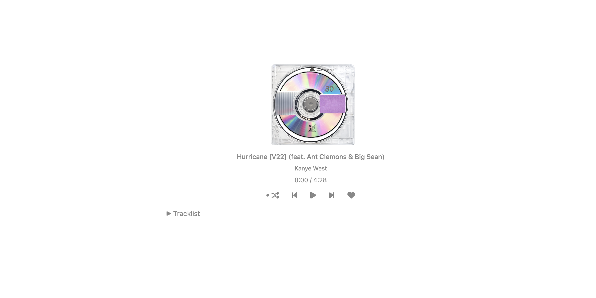

# Yandhi

A small, simple one-page website built with HTML, CSS, and JavaScript.



## Contents
- `index.html` – main page
- `styles.css` – styling
- `script.js` – interactive logic

## Installation

Open `index.html` in your browser. For local development, you can run a simple HTTP server, for example:

```bash
python3 -m http.server 8000
# then open http://localhost:8000
```

## Usage

- Open the page and interact with the UI elements to test functionality.

## Contributing

Contributions, issues and suggestions are welcome. Please open a pull request.

## License

Apache License, Version 2.0

